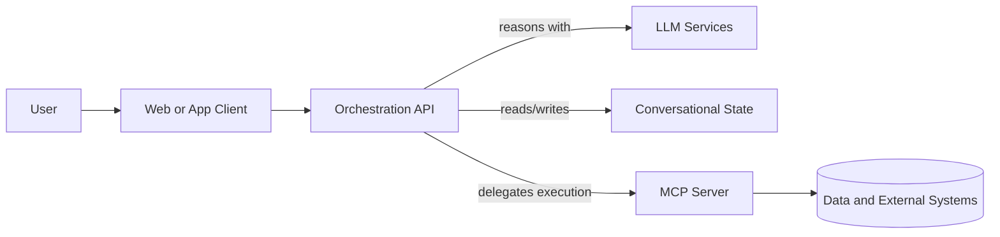
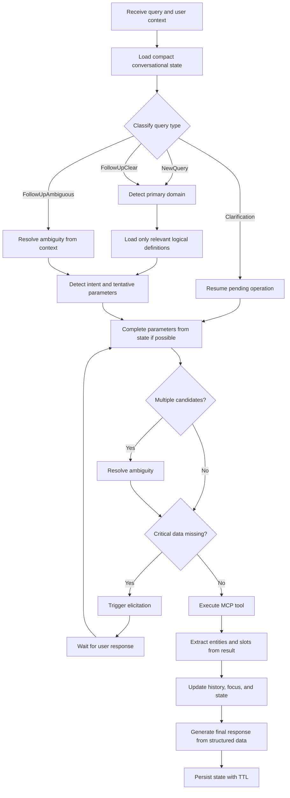

# Technical Guide to Building Robust and Efficient MCP Workflows for Conversational Interfaces

Published: April 1, 2026  
Author: Adrian Mustelier

## 1. Purpose

This guide describes a set of design patterns for building production-grade systems based on the Model Context Protocol, specifically designed for conversational interfaces, with a focus on four practical goals:

- increase accuracy in tool selection and final response quality;
- reduce token consumption and LLM operational cost;
- improve the robustness of multi-turn conversational flows;
- make it easier for other developers to maintain, evolve, and scale the system.

It is not tied to any specific domain. The goal is to offer a general architecture and workflow applicable to enterprise assistants, analytical systems, internal portals, back-offices, or any product with structured data and MCP tools.

In practice, applying these techniques in combination has taken tool selection accuracy from roughly 65% to 95% in a real production system. That improvement did not come from a single change, but from the disciplined accumulation of the patterns described throughout this guide.

To illustrate some of the techniques described, a document management system for law firms will be used as a conceptual reference. This reference serves solely as a pedagogical aid to explain design patterns, tool selection, context handling, disambiguation, and token savings. The recommendations in this guide, however, are intended to be reusable across other domains.

## 2. The Real Problem That Appears as an MCP Server Grows

A simple MCP server works fine as long as:

- there are few tools;
- queries are straightforward;
- the user always provides all parameters;
- there is no real conversational follow-up.

The problem starts when the system grows. Very common symptoms appear:

- the model picks the wrong tool;
- multiple tools compete semantically with each other;
- the prompt fills up with definitions and the token cost skyrockets;
- the user makes follow-ups like "now show me theirs" or "open the first one";
- parameters are missing and the flow breaks;
- a response that was correct in an isolated call fails within a long conversation;
- maintaining backward compatibility becomes expensive.

The conclusion is simple: a production-grade MCP system cannot be designed merely as "tool catalog + model call." It needs a more disciplined orchestration workflow.

## 3. Design Principles

Before diving into specific techniques, it is worth establishing some principles.

### 3.1 Separate Tool Execution from Conversational Orchestration

The MCP server should focus on exposing clear, safe, and well-structured tools. Conversation logic, context management, classification, and flow control should be moved to an intermediate orchestration layer.

### 3.2 Reduce the Model's Decision Space

The more tools and irrelevant context the model receives in a single decision, the more likely it is to fail. Accuracy does not usually improve with more indiscriminate information; it improves with better-filtered context.

### 3.3 Persist Useful State, Not Raw Unprocessed Transcripts

The complete raw history is usually expensive and inefficient. For robust follow-ups, it is better to maintain a compact, structured conversational state.

### 3.4 Design for Ambiguity, Not Perfect Inputs

Users omit parameters, change topics, use indirect references, and mix entities. The system must absorb this reality as part of the design, not treat it as a rare exception.

### 3.5 Govern the Tool Catalog as a Product

Tools, their names, and their descriptions are part of the reasoning system. They should not be treated as secondary implementation details.

## 4. Recommended Architecture

A robust MCP architecture typically works best with four blocks.



### 4.1 Client

Recommended responsibilities:

- send the user's query;
- receive progressive or final responses;
- display requests for missing data;
- relay elicitation responses.

### 4.2 Orchestration API

This is the most important layer of the system. Ideally, it should handle:

- authenticating and contextualizing the user;
- loading and saving conversational state;
- classifying the query type;
- selecting the relevant domain;
- reducing the tool catalog before calling the model;
- resolving ambiguity;
- executing the tool via MCP client;
- transforming structured output into natural-language responses.

### 4.3 MCP Server

Recommended responsibilities:

- expose well-defined tools;
- validate parameters;
- return structured data;
- request elicitation when critical parameters are missing;
- encapsulate access to data and external systems.

### 4.4 State Layer

It should store a compact conversational state with a reasonable TTL and low serialization cost.

## 5. Technique 1: Orchestration in an Intermediate Layer

One of the most effective decisions for improving robustness is not letting the model and the MCP server resolve everything directly between themselves.

### 5.1 Why It Improves Accuracy

The intermediate layer can:

- enrich parameters with user or tenant context;
- clean inconsistent data;
- block invalid combinations;
- better choose what context to send to the LLM and what to leave out.

### 5.2 Why It Reduces Tokens

Instead of resending the entire history and the full tool catalog on every turn, the API can send only:

- the summarized state;
- the relevant tool subset;
- recent entities;
- known slots.

## 6. Technique 2: Query Classification Before Intent Detection

Not all queries should follow the same flow. Prior classification greatly improves system control.

### 6.1 Recommended Query Types

A useful classification typically distinguishes at least:

- `NewQuery`: a new query with no dependency on prior context;
- `FollowUpClear`: a follow-up with a clear subject;
- `FollowUpAmbiguous`: a follow-up with more than one plausible candidate;
- `Clarification`: the user's response to a previous clarification question.

### 6.2 Benefits

1. Unnecessary decision recalculation is avoided.
2. Better control over when to carry forward prior context.
3. Reduced risk of contaminating a new query with stale context.
4. Execution can be routed to more specialized paths.

### 6.3 Practical Recommendation

Do not leave this classification entirely to the LLM. Combine state analysis with model-assisted classification. Heuristics and the model complement each other better than either one alone.

## 7. Technique 3: Two-Phase Detection to Save Tokens and Improve Accuracy

This is one of the techniques with the best practical return.

### 7.1 Phase 1: Detect the Primary Domain or Entity

Before choosing a specific tool, first identify the dominant scope of the query:

- cases;
- clients;
- employees;
- documents;
- tickets;
- orders;
- inventory;
- analytics.

In the reference case used in this guide, this first phase depends less on a fixed list of entities and more on how the domain has been segmented into functional areas or categories to facilitate detection. In a conversational interface, what matters is defining categories that are sufficiently clear and distinct from one another, so the system can first decide which functional block a query belongs to and only then choose the specific tool within that block.

### 7.2 Phase 2: Choose the Tool Within That Domain

Once the domain is identified, only then is the model presented with the relevant subset of tools to make the final decision.

### 7.3 What This Gains

- fewer tokens per call;
- fewer tools competing;
- less confusion from semantic similarity;
- greater traceability of the selection rationale.

### 7.4 Typical Savings

There is no universal figure, but in medium to large catalogs this technique tends to significantly reduce the context sent to the model. The larger the global catalog, the greater the relative benefit tends to be.

## 8. Technique 4: Separate the Technical Catalog from the Logical Catalog

This pattern is especially powerful and often makes a clear difference in system quality.

### 8.1 Technical Catalog

This is the actual set of tools exposed by the MCP server. It serves execution and technical discovery.

### 8.2 Logical Catalog

This is a curated set of definitions designed for the model's reasoning. It can live in JSON, in a database, or in any other versionable store.

### 8.3 Why Separating Them Matters

The catalog an MCP client needs for execution is not necessarily the same catalog the LLM should see for reasoning. The latter should be more curated, smaller, and written with semantic intent.

### 8.4 Direct Benefits

- token savings;
- better selection accuracy;
- ability to revise definitions without recompiling;
- more control over naming, examples, and rules.

## 9. Technique 5: Tool Descriptions Designed for Reasoning, Not Ornamental Documentation

A brief description like "gets information about X" is usually insufficient when multiple tools are similar.

### 9.1 What a Good Description Should Include

- what parameter it actually requires;
- what it returns exactly;
- the direction in which the relationship operates;
- when to use it;
- when not to use it.

### 9.2 Recommended Pattern

It is useful to write descriptions with conceptual blocks such as:

- `REQUIRES`
- `RETURNS`
- `DIRECTION`
- positive examples;
- negative examples.

### 9.3 Conceptual Example

It is not the same:

- "get cases by employee";
- as "get employees by case."

In real catalogs, this seemingly simple difference is a constant source of model errors. The description must make it unambiguous.

## 10. Technique 6: Consolidate Redundant Tools

When the catalog grows without control, token cost and confusion rate tend to rise.

### 10.1 Symptoms of a Bloated Catalog

- multiple tools with the same essential purpose;
- tools separated only by a simple filter;
- different names for the same behavior;
- legacy versions nobody dares to retire.

### 10.2 Recommended Strategy

Consolidate tools around canonical names and move the variation to:

- parameters;
- filters;
- compatible aliases.

### 10.3 Result

- smaller active catalog;
- less ambiguity for the model;
- more clarity for developers;
- better evolutionary compatibility.

## 11. Technique 7: Aliases for Backward Compatibility

If tools are consolidated, a transition mechanism is needed.

### 11.1 What Aliases Solve

- old prompts that still use legacy names;
- agents or clients already deployed;
- prior documentation not yet updated;
- gradual catalog migrations.

### 11.2 Real-World Alias Example

As a practical example, in our reference application several historical tools were consolidated into cleaner canonical names. A clear case:

- canonical name: `GetTaskList`
- legacy aliases: `GetPendingTasks`, `GetOverdueTasks`, `GetCompletedTasks`

The idea behind this consolidation was that the base behavior was the same: retrieving tasks. The real variation was not in the core capability but in the filter applied to the status. Instead of maintaining three nearly equivalent tools, a single canonical tool was kept, and the difference was moved to parameters like `status`.

Another useful example of the same pattern:

- canonical name: `GetLegalCaseInfo`
- legacy aliases: `GetLegalCase`, `GetLegalCaseByIdentifier`

This second case illustrates well how aliases can absorb historical or overly specific names without breaking compatibility, while the system continues reasoning about a single canonical operation.

### 11.3 Best Practices

- maintain one canonical name;
- resolve aliases on the server or MCP client side;
- instrument how often each alias is used;
- define a deprecation policy.

### 11.4 Indirect Benefit

Aliases allow refactoring the catalog without turning every architectural improvement into a breaking change. But their value goes beyond that: they also reduce duplicate code and increase the reasoning system's accuracy. In practice, a single backend capability may serve to retrieve useful information across multiple domain areas, but it is not always best to expose it to the model under a single generic name. It is often more precise to present different names depending on the functional context in which that capability is used, because this helps the model reason better about the user's intent. Aliases resolve that tension: a common implementation is reused underneath, while more expressive names — better aligned with each domain area — are preserved on top.

In summary, aliases:

- reduce duplicate code by reusing a single implementation;
- increase reasoning accuracy;
- allow exposing different, more expressive names per functional domain area, even though the same capability is reused underneath.

## 12. Technique 8: Structured Conversational State

The full textual history is not the best format for sustaining robust follow-ups.

### 12.1 Recommended Structures

A useful state typically includes:

- last executed intent;
- most recent original query;
- known slots or parameters;
- mentioned entities;
- current focal entity;
- pending clarification;
- short operation history.

### 12.2 Why It Improves Accuracy

The model receives higher-quality context:

- it knows which parameters are already resolved;
- it knows which entity is in focus;
- it knows whether the previous call returned one or many entities;
- it knows whether the user is answering a clarification question.

### 12.3 Why It Reduces Tokens

Instead of resending the entire conversation, a structured and compact summary is sent.

## 13. Technique 9: Operation History, Not Just the Last Intent

Storing only the last intent is too limited for real conversations.

### 13.1 What an Operation Should Record

- executed intent;
- parameters used;
- result type;
- entities returned;
- timestamp.

### 13.2 Practical Use

This enables responding more confidently to situations like:

- "what about the first one?";
- "show me their documents";
- "now give me only the overdue ones";
- "open the other one."

The key is not just knowing what was executed, but what that execution returned.

## 14. Technique 10: Entity Graph and Conversational Focus

Maintaining a list of mentioned entities greatly improves the handling of implicit references.

### 14.1 Useful Information Per Entity

- type;
- identifier;
- display name;
- mention frequency;
- mention timestamp;
- minimal metadata.

### 14.2 Conversational Focus

Beyond the entity graph, it is useful to maintain a notion of "current focus" to prioritize which entity is most likely in a follow-up.

### 14.3 Benefits

- better resolution of pronouns and indirect references;
- less reliance on fragile heuristics;
- fewer unnecessary clarification requests.

## 15. Technique 11: Synthetic Entities to Preserve Context

The system does not always work with a single entity. Sometimes the response represents:

- a result set;
- an aggregation;
- a list view;
- a filtered collection.

In these cases, it is worth preserving the context type even when no unique ID exists.

### 15.1 Why It Matters

Without this mechanism, the system loses continuity after responses like:

- "here are your recent documents";
- "these are the overdue tasks";
- "these are the most active clients."

Even though there is no clear singular entity, there is a semantic context that must be maintained.

## 16. Technique 12: Automatic Slot and Entity Extraction

When a tool returns structured JSON, it is worth automatically extracting:

- relevant IDs;
- display names;
- entity types;
- simple relationships.

### 16.1 Benefits

- less manual code per tool;
- consistent state updates;
- lower maintenance cost when adding new tools;
- fewer correlation errors between response and context.

### 16.2 Recommendation

Centralize this responsibility in a single cross-cutting service. Do not duplicate it tool by tool.

## 17. Technique 13: Explicit Disambiguation

When there is more than one candidate entity, it is not advisable to feign certainty.

### 17.1 A Good Disambiguation Flow

1. Gather recent candidates.
2. Evaluate focus, recency, frequency, and semantic fit.
3. If confidence is sufficient, resolve automatically.
4. If not, ask the user for clarification.

### 17.2 What This Improves

- increases factual accuracy;
- reduces silent incorrect actions;
- improves the perceived reliability of the system.

## 18. Technique 14: Pending Clarification as Formal State

When the system needs to ask "which one do you mean?", that question must be recorded in state.

### 18.1 Useful Information to Store

- original query;
- tentative intent;
- partially resolved parameters;
- proposed candidates;
- timestamp;
- additional processing flags if applicable.

### 18.2 Benefit

This ensures the user's response to the clarification is not treated as a new prompt, but as the exact continuation of a pending operation.

## 19. Technique 15: Elicitation for Missing Parameters

When critical parameters are missing, the system should not fail immediately if it can recover them from the user.

### 19.1 What Elicitation Means in This Context

It is the mechanism by which a tool requests, in a structured way, the data it needs to complete the operation.

### 19.2 When to Use It

Use it when:

- an essential identifier is missing;
- the operation would be risky or pointless without that data;
- the user can provide it easily.

Do not use it indiscriminately in every tool, because it will introduce unnecessary friction.

### 19.3 Benefits

- fewer terminal errors;
- better UX;
- higher execution success rate;
- less need to retry from scratch.

## 20. Technique 16: Bidirectional Streaming for Elicitation Without Breaking the Flow

In flows where a tool needs additional data from the user to complete its execution, the classic request-response pattern presents a fundamental problem: the operation must be aborted, return an error or a partial result, and trust that the user's next turn will resume the operation exactly where it left off. In practice, that "resuming" is fragile — it depends on the orchestrator correctly reconstructing the partial state, and on the model interpreting the user's response as a continuation rather than a new query.

Bidirectional streaming offers a cleaner solution: keeping the communication channel open while the tool waits for the user's response, so that execution is suspended without breaking.

### 20.1 The Specific Problem It Solves

When a tool detects that it is missing critical parameters and triggers an elicitation, an awkward situation arises in request-response architectures:

1. The tool cannot complete the operation.
2. It needs to return something to the user (the elicitation question).
3. But upon returning, the HTTP call terminates.
4. The user's response arrives as a completely new request.
5. The orchestrator must reconstruct the context: which tool was executing, which parameters had already been resolved, what the user was asked, and correlate the response with the original question.

This is feasible — in fact, Technique 14 (pending clarification as formal state) describes how to persist that context. But it adds significant complexity: more state to serialize, more reconstruction logic, and more surface area for subtle correlation errors.

### 20.2 How Bidirectional Streaming Solves It

With a bidirectional channel (for example, gRPC server-streaming combined with a separate response call, or pure gRPC bidirectional streaming), the flow changes substantially:

1. The client opens a stream to the orchestrator.
2. The orchestrator executes the tool and receives the elicitation request.
3. Instead of closing the connection, it sends an elicitation message over the open stream.
4. The client displays the question to the user.
5. The user responds.
6. The response travels through a correlated channel (same stream or a call linked by conversation or operation ID).
7. The tool receives the missing data and completes execution.
8. The final result is sent over the same stream.

The operation was never interrupted. There was no state reconstruction, no ambiguity about whether the user's response was a follow-up or a new query.

### 20.3 Practical Pattern: gRPC-Web with a Separate Elicitation Channel

In environments where the client is a browser, pure gRPC bidirectional streaming is not available (browsers do not support native HTTP/2 bidirectional streaming). A viable alternative that preserves most of the benefits is:

- **Main channel**: gRPC server-streaming (client → server: unary; server → client: stream). The server can send multiple messages to the client throughout the operation, including elicitation messages.
- **Response channel**: a separate gRPC unary call that the client uses to send the user's elicitation response. This call is correlated with the ongoing operation via a conversation or operation identifier.

```
Client                          Orchestrator                    MCP Tool
  │                                │                                │
  │── SendQuery (server-stream) ──▶│                                │
  │                                │── ExecuteTool ────────────────▶│
  │                                │                                │
  │                                │◀── ElicitationRequest ────────│
  │◀── StreamMsg: Elicitation ─────│                                │
  │                                │                                │
  │── SendElicitationResponse ────▶│                                │
  │    (separate unary call)       │── ResumeWithParam ───────────▶│
  │                                │                                │
  │                                │◀── ToolResult ────────────────│
  │◀── StreamMsg: FinalResponse ───│                                │
  │                                │                                │
```

This pattern keeps the server stream active throughout the entire operation, including the elicitation wait. The client does not need to reconnect or reconstruct context — it simply receives the next message when it is ready.

### 20.4 Comparison with Alternatives

**Polling**: the client periodically asks whether the tool has a response yet. Simple to implement, but adds artificial latency, unnecessary traffic, and timeout management complexity. It does not scale well with many concurrent conversations.

**WebSockets**: a full bidirectional channel in the browser. It solves the technical problem, but introduces operational complexity: persistent connection management, reconnection, stateful load balancing, and an ad hoc message protocol that must be designed, versioned, and maintained. For teams already using gRPC on the backend, WebSockets may mean a second parallel communication infrastructure.

**SSE (Server-Sent Events)**: conceptually similar to gRPC server-streaming — the server can push messages to the client. But SSE is unidirectional: the return channel requires separate HTTP requests, so correlation still depends on external state. It is a reasonable option if the infrastructure does not support gRPC, but it offers less structure than gRPC for defining message types.

**gRPC server-streaming + unary response call**: the pattern described here. It offers a good balance: the server pushes messages to the client (including elicitation), the client responds through a typed and correlated channel, and all communication is defined in Protobuf with clear contracts. It works in browsers via gRPC-Web (requires a proxy such as Envoy or grpc-web-proxy to translate HTTP/1.1 to HTTP/2).

### 20.5 Trade-offs and Practical Considerations

- **Browser compatibility**: gRPC-Web requires an intermediate proxy (Envoy, nginx with gRPC module, or a dedicated proxy). This adds a piece to the infrastructure, but once configured, it is transparent to development.
- **Timeouts**: if the elicitation takes too long (the user goes to grab a coffee), the stream may be cut by proxy or load balancer timeouts. It is advisable to implement a reconnection mechanism with an operation ID, or define a reasonable TTL for the elicitation wait with a fallback to persisted state.
- **Complexity vs. benefit**: this pattern provides more value when elicitations are frequent and multi-step flows are common. If most tools execute without elicitation, the marginal benefit may not justify the additional infrastructure. In that case, the persisted clarification pattern (Technique 14) may be sufficient.
- **Contract definition**: a significant advantage of gRPC is that elicitation messages, responses, and results are defined in `.proto` files. This enforces structure and versioning from the start, which pays off as the system grows.

### 20.6 Relationship with Other Techniques in This Guide

Bidirectional streaming does not replace structured conversational state (Technique 8) or pending clarification as formal state (Technique 14). It complements them. Even with streaming, it is advisable to persist the operation state in case the stream is cut. The difference is that, on the happy path, streaming avoids having to reconstruct that state — the operation simply continues.

Likewise, automatic entity extraction (Technique 12) is still necessary: the tool's result, whether it arrives via stream or response, must be processed the same way to update the conversational state.

## 21. Technique 17: Semantic Search Only Where It Adds Value

Vector search can be very useful, but not every tool needs it.

### 21.1 Where It Tends to Add the Most Value

- document search;
- ticket, incident, or case search;
- free-text description queries;
- entity retrieval by semantic intent rather than exact key.

### 21.2 A Good Pattern

- use embeddings when the query is fuzzy;
- maintain a fallback to classic text search;
- do not force vector retrieval on purely structured queries.

### 21.3 Relationship with Token Savings

A well-designed semantic search reduces the need for long explanatory prompts and minimizes the number of user retries to "hit" the right filter.

## 22. Technique 18: Structured Responses and Controlled Post-Processing

Tools should return structured data. The orchestration layer can then handle converting them into natural-language responses.

### 22.1 Why It Improves Accuracy

- the tool returns facts, not free-form interpretation;
- the LLM works on already delimited data;
- the risk of hallucination over backend results is reduced.

### 22.2 Why It Helps Maintenance

It clearly separates:

- the data retrieval layer;
- the reasoning layer;
- the conversational presentation layer.

## 23. Concrete Token Savings Techniques

> **Note:** this section consolidates, in quick-checklist form, several ideas already developed in previous techniques. Its purpose is to serve as a quick reference, not as new content.

Token savings usually do not come from a single optimization, but from the combination of several.

### 23.1 Reduce the Visible Catalog Per Turn

Do not send all tools in every prompt. Filter by domain or entity. *(See Technique 3.)*

### 23.2 Use Summarized State

Send slots, focus, and recent operations instead of the entire transcript. *(See Techniques 8 and 9.)*

### 23.3 Consolidate Redundant Tools

Fewer tools means less context and less confusion. *(See Technique 6.)*

### 23.4 Denser and More Curated Descriptions

A good description can reduce additional examples and repeated rules in the prompt. *(See Techniques 4 and 5.)*

### 23.5 Trim Unnecessarily Large Structured Responses

Limit results, paginate, and return only what is relevant.

### 23.6 Separate Response Generation and Tool Selection

It is not always advisable to use the same model, the same prompt, or the same context for both tasks.

## 24. Concrete Accuracy Improvement Techniques

### 24.1 Control Tool Directionality

Explicitly explain whether a tool operates `Entity A -> Entity B` or the reverse.

### 24.2 Add Negative Examples

Stating when a tool should not be used tends to help more than one might expect.

### 24.3 Mix Heuristics and LLM

Do not delegate all logic to a single prompt. Validate coherence after each important decision.

### 24.4 Resolve Parameters from State Before Asking

Before elicitation, attempt to complete with carry-over from previous slots.

### 24.5 Measure Selection Errors

If incorrect selections are not measured, the system does not truly improve.

## 25. Recommended End-to-End Workflow

A robust workflow typically follows this sequence.



1. Receive query and user context.
2. Load compact conversational state.
3. Classify the query type (`NewQuery`, `FollowUpClear`, `FollowUpAmbiguous`, `Clarification`).
4. Depending on type: detect domain, resolve ambiguity from context, or resume pending operation.
5. Load only the relevant logical definitions.
6. Detect intent and tentative parameters.
7. Complete parameters from state if possible.
8. Resolve ambiguity if there are multiple candidates.
9. Trigger elicitation if critical data is still missing; wait for the user's response and return to step 7.
10. Execute the MCP tool.
11. Extract entities and slots from the result.
12. Update history, focus, and state.
13. Generate the final response from structured data.
14. Persist state with TTL.

## 26. Tool Catalog Governance

The catalog requires ongoing discipline.

### 26.1 Recommended Rules

- one canonical name per capability;
- controlled aliases for compatibility;
- descriptions reviewed periodically;
- validation between the logical and technical catalogs;
- explicit deprecation policy.

### 26.2 Common Mistake

Allowing each new need to add yet another tool nearly identical to an existing one. In the short term it seems faster; in the medium term it degrades accuracy, cost, and maintainability.

## 27. Observability and Evaluation

A robust MCP system must be measured.

### 27.1 Minimum Metrics

- total latency per turn;
- latency per phase;
- input and output tokens;
- tool selection accuracy;
- clarification rate;
- elicitation rate;
- parameter error rate;
- user retry ratio.

### 27.2 Useful Logs

- classified query type;
- detected domain;
- selected tool;
- selection rationale;
- final parameters used;
- extracted entities;
- cause of clarification or elicitation.

### 27.3 Why It Matters So Much

Most MCP failures are not obvious binary failures. They are selection, context, or continuity failures. If they are not measured, they look like random errors and cannot be corrected systematically.

## 28. Production Robustness Checklist

### 28.1 Architecture

- separate orchestration and MCP execution;
- maintain compact conversational state;
- design clarification and elicitation flows.

### 28.2 Catalog

- reduce redundancies;
- use canonical names;
- add aliases with control;
- curate descriptions for reasoning.

### 28.3 Tokens

- use two-phase detection;
- send only relevant context;
- limit large structured outputs;
- do not reuse the same prompt for everything.

### 28.4 Accuracy

- validate coherence after LLM decisions;
- measure selection errors;
- introduce negative examples;
- resolve ambiguity with explicit criteria.

### 28.5 Operations

- structured logs;
- per-phase metrics;
- reasonable timeouts;
- backpressure control;
- secure secrets and configuration policy.

## 29. Recommendations for Other Developers

If you are looking for a more robust MCP configuration and workflow, the main recommendation is to stop thinking of the system as a simple "model that calls tools." It is better to think of it as a chain of specialized decisions where each step reduces uncertainty.

The most effective formula tends to be:

- less context, but better selected;
- fewer active tools, but better defined;
- more structured state and fewer raw transcripts;
- more validation and less blind trust in a single model call.

In other words, robustness does not come from "making prompts longer," but from designing a workflow where the model has fewer opportunities to get it wrong.

## 30. Conclusion

Building a reliable MCP system requires more than exposing tools. It requires an architecture that manages selection, continuity, ambiguity, missing parameters, token efficiency, and catalog evolution.

The techniques with the highest practical impact are:

- prior query type classification;
- two-phase detection;
- separation between technical and logical catalogs;
- reasoning-oriented descriptions;
- tool consolidation and aliases;
- structured conversational state;
- explicit disambiguation;
- elicitation integrated into the flow;
- bidirectional streaming for operation continuity;
- real per-phase observability.

Applied together, these techniques enable building MCP assistants that are more accurate, cheaper to operate, and significantly more robust against the real conversational complexity that appears when a system stops being a demo and starts being used intensively. In a real production system, combining these techniques took tool selection accuracy from ~65% to ~95% — a difference that translates directly into fewer silent errors, fewer user retries, and significantly lower operational cost.

## 31. Next Steps and Deeper Dives

This guide presents each technique with enough depth to understand the problem it solves, the recommended pattern, and its trade-offs. It intentionally does not go into full implementations: each of these techniques could be developed as a standalone article with code, detailed sequence diagrams, and before-and-after metrics.

Some of the lines that could be expanded in future articles:

- concrete implementation of two-phase detection with Semantic Kernel and dynamic catalogs;
- `.proto` contract design for elicitation over gRPC-Web with working examples;
- entity graph and conversational focus patterns in C# with EF Core;
- testing and evaluation strategies for measuring tool selection accuracy;
- semantic search integration with structured fallback in real MCP catalogs.

If any of these techniques is especially relevant to your use case and you would like to see a more detailed write-up with code and production examples, let me know — it helps me prioritize what to publish next.