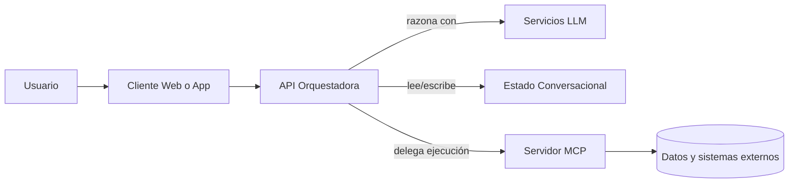
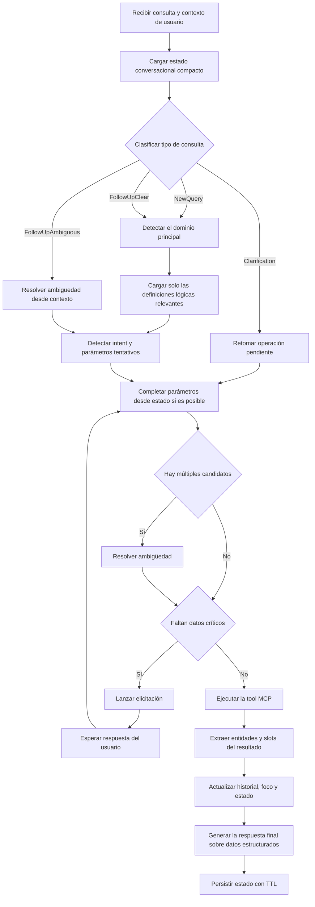

# Guía técnica para construir workflows MCP robustos y eficientes en interfaces conversacionales

Publicado: 1 de abril de 2026  
Autor: Adrian Mustelier

## 1. Objetivo

Esta guía describe un conjunto de patrones de diseño para construir sistemas basados en Model Context Protocol orientados a producción, especialmente pensados para interfaces conversacionales, con foco en cuatro objetivos prácticos:

- aumentar la precisión en la selección de tools y en la respuesta final;
- reducir el consumo de tokens y el coste operativo del LLM;
- mejorar la robustez de los flujos conversacionales multi-turno;
- facilitar que otros desarrolladores mantengan, evolucionen y escalen el sistema.

No se centra en un dominio concreto. El objetivo es ofrecer una arquitectura y un workflow general que pueda aplicarse a asistentes empresariales, sistemas analíticos, portales internos, backoffices o productos con datos estructurados y herramientas MCP.

En la práctica, aplicar estas técnicas de forma combinada ha permitido pasar de aproximadamente un 65% de precisión en la selección de tools a un 95% en un sistema real en producción. Esa mejora no provino de un solo cambio, sino de la acumulación disciplinada de los patrones que se describen a lo largo de esta guía.

Para ilustrar algunas de las técnicas descritas, se tomará como referencia conceptual un sistema de gestión documental para despachos de abogados. Esa referencia se usará solo como apoyo pedagógico para explicar patrones de diseño, selección de tools, manejo de contexto, desambiguación y ahorro de tokens. Las recomendaciones de esta guía, no obstante, están planteadas para ser reutilizables en otros dominios.

## 2. Problema real que aparece al crecer un servidor MCP

Un servidor MCP sencillo funciona bien mientras:

- hay pocas tools;
- las consultas son directas;
- el usuario siempre proporciona todos los parámetros;
- no existe seguimiento conversacional real.

El problema empieza cuando el sistema crece. Aparecen síntomas muy frecuentes:

- el modelo elige la tool equivocada;
- varias tools compiten semánticamente entre sí;
- el prompt se llena de definiciones y el coste en tokens se dispara;
- el usuario hace follow-ups como "y ahora muéstrame los suyos" o "abre el primero";
- faltan parámetros y el flujo se rompe;
- una respuesta correcta en una llamada aislada falla dentro de una conversación larga;
- mantener compatibilidad hacia atrás se vuelve costoso.

La conclusión es simple: un sistema MCP útil en producción no puede diseñarse solo como "catálogo de tools + llamada al modelo". Necesita un workflow de orquestación más disciplinado.

## 3. Principios de diseño

Antes de entrar en técnicas concretas, conviene fijar algunos principios.

### 3.1 Separar ejecución de tools y orquestación conversacional

El servidor MCP debería centrarse en exponer herramientas claras, seguras y estructuradas. La lógica de conversación, contexto, clasificación y control de flujo conviene moverla a una capa orquestadora intermedia.

### 3.2 Reducir el espacio de decisión del modelo

Cuantas más tools y más contexto irrelevante reciba el modelo en una sola decisión, más probabilidades hay de que falle. La precisión no suele mejorar con más información indiscriminada; mejora con contexto mejor filtrado.

### 3.3 Persistir estado útil, no transcriptos completos sin procesar

El historial bruto completo suele ser caro y poco eficiente. Para follow-ups robustos es mejor mantener un estado conversacional compacto y estructurado.

### 3.4 Diseñar para ambigüedad, no asumir inputs perfectos

Los usuarios omiten parámetros, cambian de tema, usan referencias indirectas y mezclan entidades. El sistema debe absorber esa realidad como parte del diseño, no como una excepción rara.

### 3.5 Gobernar el catálogo de tools como producto

Las tools, sus nombres y sus descripciones son parte del sistema de razonamiento. No deben tratarse como detalles secundarios de implementación.

## 4. Arquitectura recomendada

Una arquitectura robusta para MCP suele funcionar mejor con cuatro bloques.



### 4.1 Cliente

Responsabilidades recomendadas:

- enviar la consulta del usuario;
- recibir respuestas progresivas o finales;
- mostrar solicitudes de datos faltantes;
- reenviar respuestas de elicitación.

### 4.2 API orquestadora

Es la capa más importante del sistema. Idealmente debe encargarse de:

- autenticar y contextualizar al usuario;
- cargar y guardar estado conversacional;
- clasificar el tipo de consulta;
- seleccionar el dominio relevante;
- reducir el catálogo de tools antes de llamar al modelo;
- resolver ambigüedad;
- ejecutar la tool vía cliente MCP;
- transformar la salida estructurada en respuesta natural.

### 4.3 Servidor MCP

Responsabilidades recomendadas:

- exponer tools bien definidas;
- validar parámetros;
- devolver datos estructurados;
- solicitar elicitación cuando faltan parámetros críticos;
- encapsular acceso a datos y a sistemas externos.

### 4.4 Capa de estado

Debe almacenar un estado conversacional compacto, con TTL razonable y bajo coste de serialización.

## 5. Técnica 1: orquestación en una capa intermedia

Una de las decisiones más efectivas para mejorar robustez es no dejar que el modelo y el servidor MCP resuelvan todo directamente entre sí.

### 5.1 Por qué mejora la precisión

La capa intermedia puede:

- enriquecer los parámetros con contexto de usuario o tenant;
- limpiar datos inconsistentes;
- bloquear combinaciones inválidas;
- escoger mejor qué contexto sí y qué contexto no enviar al LLM.

### 5.2 Por qué reduce tokens

En lugar de reenviar todo el historial y todo el catálogo de tools en cada turno, la API puede mandar solo:

- el estado resumido;
- el subconjunto de tools relevante;
- las entidades recientes;
- los slots conocidos.

## 6. Técnica 2: clasificación de la consulta antes de detectar el intent

No todas las consultas deben seguir el mismo flujo. Una clasificación previa mejora mucho el control del sistema.

### 6.1 Tipos recomendados de consulta

Una clasificación útil suele distinguir al menos:

- `NewQuery`: consulta nueva, sin depender del contexto previo;
- `FollowUpClear`: seguimiento con sujeto claro;
- `FollowUpAmbiguous`: seguimiento con más de un candidato plausible;
- `Clarification`: respuesta del usuario a una pregunta de aclaración previa.

### 6.2 Beneficios

1. Se evita recalcular decisiones innecesarias.
2. Se controla mejor cuándo arrastrar contexto previo.
3. Se reduce el riesgo de contaminar una consulta nueva con contexto viejo.
4. Se puede dirigir la ejecución a rutas más especializadas.

### 6.3 Recomendación práctica

No dejes esta clasificación enteramente al LLM. Combina análisis de estado con clasificación asistida por modelo. La heurística y el modelo se complementan mejor que cualquiera de los dos por separado.

## 7. Técnica 3: detección en dos fases para ahorrar tokens y mejorar exactitud

Esta es una de las técnicas con mejor retorno práctico.

### 7.1 Fase 1: detectar el dominio o entidad principal

Antes de elegir una tool concreta, identifica primero el ámbito dominante de la consulta:

- casos;
- clientes;
- empleados;
- documentos;
- tickets;
- órdenes;
- inventario;
- analítica.

En el caso de referencia que se usa en esta guía, esta primera fase no depende tanto de una lista fija de entidades como de cómo se haya segmentado el dominio en áreas o categorías funcionales para facilitar la detección. En una interfaz conversacional, lo importante es definir categorías suficientemente claras y separadas entre sí, de modo que el sistema pueda decidir primero a qué bloque funcional pertenece la consulta y solo después elegir la tool concreta dentro de ese bloque.

### 7.2 Fase 2: elegir la tool dentro de ese dominio

Una vez identificado el dominio, solo entonces se presenta al modelo el subconjunto de tools relevantes para tomar la decisión final.

### 7.3 Qué se gana con esto

- menos tokens por llamada;
- menos tools en competencia;
- menor confusión por similitud semántica;
- mayor trazabilidad del motivo de selección.

### 7.4 Ahorro típico

No existe una cifra universal, pero en catálogos medianos o grandes esta técnica suele reducir de forma significativa el contexto enviado al modelo. Cuanto más grande es el catálogo global, mayor suele ser el beneficio relativo.

## 8. Técnica 4: separar catálogo técnico y catálogo lógico

Este patrón es especialmente potente y suele marcar una diferencia clara en la calidad del sistema.

### 8.1 Catálogo técnico

Es el conjunto real de tools expuestas por el servidor MCP. Sirve para ejecución y descubrimiento técnico.

### 8.2 Catálogo lógico

Es un conjunto curado de definiciones pensado para el razonamiento del modelo. Puede vivir en JSON, en base de datos o en otro soporte versionable.

### 8.3 Por qué conviene separarlos

El catálogo que necesita un cliente MCP para ejecutar no es necesariamente el mismo catálogo que conviene mostrar al LLM para razonar. El segundo debería estar más curado, ser más pequeño y estar redactado con intención semántica.

### 8.4 Beneficios directos

- ahorro de tokens;
- mejor precisión en selección;
- posibilidad de revisar definiciones sin recompilar;
- más control sobre naming, ejemplos y reglas.

## 9. Técnica 5: descripciones de tools pensadas para razonamiento, no para documentación ornamental

Una descripción breve del tipo "obtiene información de X" suele ser insuficiente cuando varias tools son parecidas.

### 9.1 Qué debería incluir una buena descripción

- qué parámetro requiere realmente;
- qué devuelve exactamente;
- en qué dirección opera la relación;
- cuándo usarla;
- cuándo no usarla.

### 9.2 Patrón recomendado

Es útil redactar descripciones con bloques conceptuales como:

- `REQUIRES`
- `RETURNS`
- `DIRECTION`
- ejemplos positivos;
- ejemplos negativos.

### 9.3 Ejemplo conceptual

No es lo mismo:

- "obtener casos por empleado";
- que "obtener empleados por caso".

En catálogos reales, esta diferencia aparentemente simple es una fuente constante de errores del modelo. La descripción debe explicitarla sin ambigüedad.

## 10. Técnica 6: consolidar tools redundantes

Cuando el catálogo crece sin control, el coste en tokens y la tasa de confusión tienden a subir.

### 10.1 Síntomas de catálogo inflado

- varias tools con el mismo propósito esencial;
- tools separadas solo por un filtro simple;
- nombres distintos para el mismo comportamiento;
- versiones heredadas que nadie se atreve a retirar.

### 10.2 Estrategia recomendada

Consolidar tools alrededor de nombres canónicos y mover la variación a:

- parámetros;
- filtros;
- alias compatibles.

### 10.3 Resultado

- menor catálogo activo;
- menos ambigüedad para el modelo;
- más claridad para desarrolladores;
- mejor compatibilidad evolutiva.

## 11. Técnica 7: aliases para compatibilidad hacia atrás

Si se consolidan tools, hace falta un mecanismo de transición.

### 11.1 Qué resuelven los aliases

- prompts antiguos que siguen usando nombres heredados;
- agentes o clientes ya desplegados;
- documentación previa aún no actualizada;
- migraciones graduales del catálogo.

### 11.2 Ejemplo real de aliases

Como ejemplo práctico, en nuestra aplicación de referencia se consolidaron varias tools históricas en nombres canónicos más limpios. Un caso claro es este:

- nombre canónico: `GetTaskList`
- aliases heredados: `GetPendingTasks`, `GetOverdueTasks`, `GetCompletedTasks`

La idea detrás de esta consolidación es que el comportamiento base era el mismo: recuperar tareas. La variación real no estaba en la capability principal, sino en el filtro aplicado sobre el estado. En lugar de mantener tres tools casi equivalentes, se dejó una sola tool canónica y se trasladó la diferencia a parámetros como `status`.

Otro ejemplo útil del mismo patrón es:

- nombre canónico: `GetLegalCaseInfo`
- aliases heredados: `GetLegalCase`, `GetLegalCaseByIdentifier`

Este segundo caso ilustra bien cómo los aliases permiten absorber nombres históricos o demasiado específicos sin romper compatibilidad, mientras el sistema sigue razonando sobre una única operación canónica.

### 11.3 Buenas prácticas

- mantener un nombre canónico;
- resolver aliases del lado servidor o cliente MCP;
- instrumentar cuántas veces se usa cada alias;
- definir política de deprecación.

### 11.4 Beneficio indirecto

Los aliases permiten refactorizar el catálogo sin convertir cada mejora de arquitectura en una ruptura de compatibilidad. Pero su valor no se limita a eso: también permiten reducir código duplicado y aumentar la precisión del sistema de razonamiento. En la práctica, una misma capability de backend puede servir para recuperar información útil en varios ámbitos del dominio, pero no siempre conviene exponerla al modelo con un único nombre genérico. A menudo resulta más preciso presentar nombres distintos según el contexto funcional en el que esa capacidad se utiliza, porque eso ayuda al modelo a razonar mejor sobre la intención del usuario. Los aliases permiten resolver esa tensión: por debajo se reutiliza una implementación común, y hacia arriba se conservan nombres más expresivos y mejor alineados con cada ámbito del dominio.

En resumen, los aliases:

- reducen código duplicado al reutilizar una misma implementación;
- aumentan la precisión del razonamiento;
- permiten exponer nombres distintos y más expresivos según el ámbito funcional del dominio, aunque por debajo se reutilice la misma capability.

## 12. Técnica 8: estado conversacional estructurado

El historial textual completo no es el mejor formato para sostener follow-ups robustos.

### 12.1 Estructuras recomendadas

Un estado útil suele incluir:

- último intent ejecutado;
- query original más reciente;
- slots o parámetros conocidos;
- entidades mencionadas;
- entidad focal actual;
- clarificación pendiente;
- historial corto de operaciones.

### 12.2 Por qué mejora la precisión

El modelo recibe contexto de más calidad:

- sabe qué parámetros ya están resueltos;
- sabe qué entidad está en foco;
- sabe si la llamada anterior devolvió una o muchas entidades;
- sabe si el usuario está contestando a una clarificación.

### 12.3 Por qué reduce tokens

En vez de reenviar la conversación entera, se envía un resumen estructurado y compacto.

## 13. Técnica 9: historial de operaciones, no solo último intent

Guardar solo el último intent es demasiado pobre para conversaciones reales.

### 13.1 Qué debería registrar una operación

- intent ejecutado;
- parámetros usados;
- tipo de resultado;
- entidades devueltas;
- timestamp.

### 13.2 Utilidad práctica

Esto permite responder con más seguridad a situaciones como:

- "¿y el primero?";
- "muéstrame sus documentos";
- "ahora dame solo los vencidos";
- "abre el otro".

La clave no es solo saber qué se ejecutó, sino qué devolvió esa ejecución.

## 14. Técnica 10: entity graph y foco conversacional

Mantener una lista de entidades mencionadas mejora enormemente el manejo de referencias implícitas.

### 14.1 Información útil por entidad

- tipo;
- identificador;
- nombre mostrado;
- frecuencia de mención;
- momento de mención;
- metadatos mínimos.

### 14.2 Foco conversacional

Además del grafo de entidades, conviene mantener una noción de "foco actual" para priorizar cuál es la entidad más probable en un follow-up.

### 14.3 Beneficios

- mejor resolución de pronombres y referencias indirectas;
- menos dependencia de heurísticas frágiles;
- menor necesidad de aclaraciones innecesarias.

## 15. Técnica 11: entidades sintéticas para preservar contexto

No siempre se trabaja con una entidad individual. A veces la respuesta representa:

- un conjunto de resultados;
- una agregación;
- una vista de lista;
- una colección filtrada.

En esos casos conviene preservar el tipo de contexto aunque no exista un ID único.

### 15.1 Por qué importa

Sin este mecanismo, el sistema pierde continuidad después de respuestas como:

- "estos son tus documentos recientes";
- "estas son las tareas vencidas";
- "estos son los clientes más activos".

Aunque no haya una entidad singular clara, sí existe un contexto semántico que debe mantenerse.

## 16. Técnica 12: extracción automática de slots y entidades

Cuando una tool devuelve JSON estructurado, conviene extraer de ahí automáticamente:

- IDs relevantes;
- nombres visibles;
- tipos de entidad;
- relaciones simples.

### 16.1 Beneficios

- menos código manual por tool;
- actualización consistente del estado;
- menor coste de mantenimiento al añadir nuevas tools;
- reducción de errores de correlación entre respuesta y contexto.

### 16.2 Recomendación

Centraliza esta responsabilidad en un solo servicio transversal. No la dupliques tool por tool.

## 17. Técnica 13: desambiguación explícita

Cuando hay más de una entidad candidata, no conviene fingir certeza.

### 17.1 Buen flujo de desambiguación

1. reunir candidatos recientes;
2. evaluar foco, recencia, frecuencia y ajuste semántico;
3. si la confianza es suficiente, resolver automáticamente;
4. si no lo es, pedir aclaración al usuario.

### 17.2 Qué mejora esto

- aumenta precisión factual;
- reduce acciones incorrectas silenciosas;
- mejora la percepción de fiabilidad del sistema.

## 18. Técnica 14: clarificación pendiente como estado formal

Cuando el sistema necesita preguntar "¿a cuál te refieres?", esa pregunta debe quedar registrada en estado.

### 18.1 Información útil a guardar

- query original;
- intent tentativo;
- parámetros parciales ya resueltos;
- candidatos propuestos;
- timestamp;
- flags de procesamiento adicional si existen.

### 18.2 Beneficio

Esto permite que la respuesta del usuario a la aclaración no se trate como un prompt nuevo, sino como la continuación exacta de una operación pendiente.

## 19. Técnica 15: elicitación para parámetros faltantes

Cuando faltan parámetros críticos, el sistema no debería fallar inmediatamente si puede recuperarlos del usuario.

### 19.1 Qué es elicitación en este contexto

Es el mecanismo por el cual una tool solicita de forma estructurada los datos que faltan para completar la operación.

### 19.2 Cuándo usarla

Úsala cuando:

- falta un identificador esencial;
- la operación sería arriesgada o inútil sin ese dato;
- el usuario puede proporcionarlo de forma sencilla.

No la uses indiscriminadamente en cada tool, porque introducirás fricción innecesaria.

### 19.3 Beneficios

- menos errores terminales;
- mejor UX;
- mayor tasa de éxito de ejecución;
- menos necesidad de reintentar desde cero.

## 20. Técnica 16: streaming bidireccional para elicitación sin ruptura de flujo

En flujos donde una tool necesita datos adicionales del usuario para completar su ejecución, el patrón clásico de request-response presenta un problema fundamental: la operación debe abortarse, devolver un error o un resultado parcial, y confiar en que el siguiente turno del usuario retome la operación exactamente donde se quedó. En la práctica, ese "retomar" es frágil — depende de que el orquestador reconstruya correctamente el estado parcial, y de que el modelo interprete la respuesta del usuario como continuación y no como consulta nueva.

El streaming bidireccional ofrece una solución más limpia: mantener el canal de comunicación abierto mientras la tool espera la respuesta del usuario, de modo que la ejecución se suspenda sin romperse.

### 20.1 El problema concreto que resuelve

Cuando una tool detecta que le faltan parámetros críticos y lanza una elicitación, se produce una situación incómoda en arquitecturas request-response:

1. La tool no puede completar la operación.
2. Necesita devolver algo al usuario (la pregunta de elicitación).
3. Pero al devolver, la llamada HTTP termina.
4. La respuesta del usuario llega como un request completamente nuevo.
5. El orquestador debe reconstruir el contexto: qué tool estaba ejecutándose, qué parámetros ya se habían resuelto, qué se le preguntó al usuario, y correlacionar la respuesta con la pregunta original.

Esto es factible — de hecho, la Técnica 14 (clarificación pendiente como estado formal) describe cómo persistir ese contexto. Pero añade complejidad significativa: más estado que serializar, más lógica de reconstrucción, y más superficie para errores sutiles de correlación.

### 20.2 Cómo lo resuelve el streaming bidireccional

Con un canal bidireccional (por ejemplo, gRPC server-streaming combinado con una llamada separada de respuesta, o gRPC bidirectional streaming puro), el flujo cambia sustancialmente:

1. El cliente abre un stream hacia el orquestador.
2. El orquestador ejecuta la tool y recibe la solicitud de elicitación.
3. En lugar de cerrar la conexión, envía un mensaje de elicitación por el stream abierto.
4. El cliente muestra la pregunta al usuario.
5. El usuario responde.
6. La respuesta viaja por un canal correlacionado (mismo stream o llamada vinculada por ID de conversación).
7. La tool recibe el dato faltante y completa la ejecución.
8. El resultado final se envía por el mismo stream.

La operación nunca se interrumpió. No hubo reconstrucción de estado, ni ambigüedad sobre si la respuesta del usuario era un follow-up o una consulta nueva.

### 20.3 Patrón práctico: gRPC Web con canal de elicitación separado

En entornos donde el cliente es un navegador, gRPC bidireccional puro no está disponible (los navegadores no soportan HTTP/2 bidireccional nativo). Una alternativa viable que conserva la mayoría de los beneficios es:

- **Canal principal**: gRPC server-streaming (cliente → servidor: unario; servidor → cliente: stream). El servidor puede enviar múltiples mensajes al cliente a lo largo de la operación, incluyendo mensajes de elicitación.
- **Canal de respuesta**: una llamada gRPC unaria separada que el cliente usa para enviar la respuesta del usuario a la elicitación. Esta llamada se correlaciona con la operación en curso mediante un identificador de conversación o de operación.

```
Cliente                         Orquestador                     MCP Tool
  │                                │                                │
  │── SendQuery (server-stream) ──▶│                                │
  │                                │── ExecuteTool ────────────────▶│
  │                                │                                │
  │                                │◀── ElicitationRequest ────────│
  │◀── StreamMsg: Elicitation ─────│                                │
  │                                │                                │
  │── SendElicitationResponse ────▶│                                │
  │    (llamada unaria separada)   │── ResumeWithParam ───────────▶│
  │                                │                                │
  │                                │◀── ToolResult ────────────────│
  │◀── StreamMsg: FinalResponse ───│                                │
  │                                │                                │
```

Este patrón mantiene el stream del servidor activo durante toda la operación, incluyendo la espera de elicitación. El cliente no necesita reconectar ni reconstruir contexto — simplemente recibe el siguiente mensaje cuando esté listo.

### 20.4 Comparación con alternativas

**Polling**: el cliente pregunta periódicamente si la tool ya tiene respuesta. Simple de implementar, pero añade latencia artificial, tráfico innecesario y complejidad en la gestión de timeouts. No escala bien cuando hay muchas conversaciones concurrentes.

**WebSockets**: canal bidireccional completo en navegador. Resuelve el problema técnico, pero introduce complejidad operativa: gestión de conexiones persistentes, reconexión, balanceo de carga stateful, y un protocolo de mensajes ad hoc que hay que diseñar, versionar y mantener. Para equipos que ya usan gRPC en el backend, WebSockets puede suponer una segunda infraestructura de comunicación paralela.

**SSE (Server-Sent Events)**: similar al server-streaming de gRPC en concepto — el servidor puede enviar mensajes push al cliente. Pero SSE es unidireccional: el canal de retorno requiere requests HTTP separados, con lo cual la correlación sigue dependiendo de estado externo. Es una opción razonable si la infraestructura no soporta gRPC, pero ofrece menos estructura que gRPC para definir tipos de mensaje.

**gRPC server-streaming + llamada unaria de respuesta**: el patrón descrito aquí. Ofrece buen equilibrio: el servidor empuja mensajes al cliente (incluyendo elicitación), el cliente responde por un canal tipado y correlacionado, y toda la comunicación está definida en Protobuf con contratos claros. Funciona en navegador vía gRPC-Web (requiere un proxy como Envoy o grpc-web-proxy para traducir HTTP/1.1 a HTTP/2).

### 20.5 Trade-offs y consideraciones prácticas

- **Compatibilidad con navegadores**: gRPC-Web requiere un proxy intermedio (Envoy, nginx con módulo gRPC, o un proxy dedicado). Esto añade una pieza a la infraestructura, pero una vez configurada, es transparente para el desarrollo.
- **Timeouts**: si la elicitación tarda mucho (el usuario se va a tomar café), el stream puede cortarse por timeouts del proxy o del load balancer. Conviene implementar un mecanismo de reconexión con ID de operación, o definir un TTL razonable para la espera de elicitación con fallback a estado persistido.
- **Complejidad vs. beneficio**: este patrón aporta más valor cuando las elicitaciones son frecuentes y los flujos multi-paso son comunes. Si la mayoría de las tools se ejecutan sin elicitación, el beneficio marginal puede no justificar la infraestructura adicional. En ese caso, el patrón de clarificación persistida (Técnica 14) puede ser suficiente.
- **Definición de contratos**: una ventaja significativa de gRPC es que los mensajes de elicitación, las respuestas y los resultados están definidos en `.proto` files. Esto impone estructura y versionado desde el inicio, lo cual se agradece cuando el sistema crece.

### 20.6 Relación con otras técnicas de esta guía

El streaming bidireccional no reemplaza el estado conversacional estructurado (Técnica 8) ni la clarificación pendiente como estado formal (Técnica 14). Las complementa. Incluso con streaming, conviene persistir el estado de la operación por si el stream se corta. La diferencia es que, en el camino feliz, el streaming evita tener que reconstruir ese estado — la operación simplemente continúa.

Del mismo modo, la extracción automática de entidades (Técnica 12) sigue siendo necesaria: el resultado de la tool, llegue por stream o por response, debe procesarse igual para actualizar el estado conversacional.

## 21. Técnica 17: búsqueda semántica solo donde aporta valor

La búsqueda vectorial puede ser muy útil, pero no todas las tools la necesitan.

### 21.1 Dónde suele aportar más

- búsqueda de documentos;
- búsqueda de tickets, incidencias o casos;
- consultas por descripción libre;
- recuperación de entidades por intención semántica y no por clave exacta.

### 21.2 Buen patrón

- usar embeddings cuando la consulta es difusa;
- mantener fallback a búsqueda textual clásica;
- no forzar recuperación vectorial en consultas puramente estructuradas.

### 21.3 Relación con ahorro de tokens

Una búsqueda semántica bien diseñada reduce la necesidad de prompts largos explicativos y minimiza el número de reintentos del usuario para "acertar" con el filtro correcto.

## 22. Técnica 18: respuestas estructuradas y postprocesado controlado

Las tools deberían devolver datos estructurados. La capa orquestadora puede encargarse luego de convertirlos en respuesta natural.

### 22.1 Por qué mejora la precisión

- la tool devuelve hechos, no interpretación libre;
- el LLM trabaja sobre datos ya delimitados;
- se reduce el riesgo de alucinación sobre resultados de backend.

### 22.2 Por qué ayuda al mantenimiento

Separa claramente:

- capa de obtención de datos;
- capa de razonamiento;
- capa de presentación conversacional.

## 23. Técnicas concretas de ahorro de tokens

> **Nota:** esta sección consolida en forma de checklist rápido varias ideas ya desarrolladas en las técnicas anteriores. Su propósito es servir como referencia rápida, no como contenido nuevo.

El ahorro de tokens no suele venir de una sola optimización, sino de la combinación de varias.

### 23.1 Reducir el catálogo visible por turno

No enviar todas las tools en cada prompt. Filtrar por dominio o entidad. *(Ver Técnica 3.)*

### 23.2 Usar estado resumido

Mandar slots, foco y operaciones recientes en lugar de todo el transcript. *(Ver Técnicas 8 y 9.)*

### 23.3 Consolidar tools redundantes

Menos tools significa menos contexto y menos confusión. *(Ver Técnica 6.)*

### 23.4 Descripciones más densas y curadas

Una buena descripción puede reducir ejemplos adicionales y reglas repetidas en el prompt. *(Ver Técnicas 4 y 5.)*

### 23.5 Cortar respuestas estructuradas innecesariamente grandes

Limitar resultados, paginar y devolver solo lo relevante.

### 23.6 Separar generación de respuesta y selección de tool

No siempre conviene usar el mismo modelo, el mismo prompt ni el mismo contexto para ambas tareas.

## 24. Técnicas concretas de mejora de precisión

### 24.1 Controlar la direccionalidad de las tools

Explicar de forma explícita si una tool hace `Entidad A -> Entidad B` o al revés.

### 24.2 Añadir ejemplos negativos

Decir cuándo no debe usarse una tool suele ayudar más de lo que parece.

### 24.3 Mezclar heurística y LLM

No delegar toda la lógica a un único prompt. Validar coherencia después de cada decisión importante.

### 24.4 Resolver parámetros desde estado antes de preguntar

Antes de elicitación, intentar completar con carry-over de slots previos.

### 24.5 Medir errores de selección

Si no se miden las selecciones incorrectas, el sistema no mejora de verdad.

## 25. Workflow recomendado de extremo a extremo

Un workflow robusto suele seguir esta secuencia.



1. Recibir consulta y contexto de usuario.
2. Cargar estado conversacional compacto.
3. Clasificar el tipo de consulta (`NewQuery`, `FollowUpClear`, `FollowUpAmbiguous`, `Clarification`).
4. Según el tipo: detectar dominio, resolver ambigüedad desde contexto, o retomar operación pendiente.
5. Cargar solo las definiciones lógicas relevantes.
6. Detectar intent y parámetros tentativos.
7. Completar parámetros desde estado si es posible.
8. Resolver ambigüedad si hay múltiples candidatos.
9. Lanzar elicitación si faltan datos críticos; esperar respuesta del usuario y volver al paso 7.
10. Ejecutar la tool MCP.
11. Extraer entidades y slots del resultado.
12. Actualizar historial, foco y estado.
13. Generar la respuesta final sobre datos estructurados.
14. Persistir estado con TTL.

## 26. Gobernanza del catálogo de tools

El catálogo necesita disciplina continua.

### 26.1 Reglas recomendadas

- un nombre canónico por capability;
- aliases controlados para compatibilidad;
- descripciones revisadas periódicamente;
- validación entre catálogo lógico y catálogo técnico;
- política de deprecación explícita.

### 26.2 Error habitual

Permitir que cada nueva necesidad añada otra tool casi igual a una anterior. A corto plazo parece más rápido; a medio plazo degrada precisión, coste y mantenibilidad.

## 27. Observabilidad y evaluación

Un sistema MCP robusto debe medirse.

### 27.1 Métricas mínimas

- latencia total por turno;
- latencia por fase;
- tokens de entrada y salida;
- precisión de selección de tools;
- tasa de clarificaciones;
- tasa de elicitaciones;
- tasa de errores de parámetros;
- ratio de reintentos del usuario.

### 27.2 Logs útiles

- tipo de consulta clasificada;
- dominio detectado;
- tool seleccionada;
- motivo de selección;
- parámetros finales usados;
- entidades extraídas;
- causa de clarificación o elicitación.

### 27.3 Por qué importa tanto

La mayoría de fallos en MCP no son fallos binarios obvios. Son fallos de selección, contexto o continuidad. Si no se miden, parecen errores aleatorios y no se pueden corregir de forma sistemática.

## 28. Checklist de robustez para producción

### 28.1 Arquitectura

- separar orquestación y ejecución MCP;
- mantener estado conversacional compacto;
- diseñar flujo de clarificación y elicitación.

### 28.2 Catálogo

- reducir redundancias;
- usar nombres canónicos;
- añadir aliases con control;
- curar descripciones para razonamiento.

### 28.3 Tokens

- usar detección en dos fases;
- mandar solo contexto relevante;
- limitar salidas estructuradas grandes;
- no reutilizar el mismo prompt para todo.

### 28.4 Precisión

- validar coherencia tras decisiones del LLM;
- medir errores de selección;
- introducir ejemplos negativos;
- resolver ambigüedad con criterios explícitos.

### 28.5 Operación

- logs estructurados;
- métricas por fase;
- timeouts razonables;
- control de backpressure;
- política de secretos y configuración segura.

## 29. Recomendaciones para otros desarrolladores

Si se busca una configuración y un workflow MCP más robusto, la recomendación principal es no pensar el sistema como un simple "modelo que llama tools". Es mejor pensarlo como una cadena de decisiones especializadas donde cada paso reduce incertidumbre.

La fórmula más eficaz suele ser:

- menos contexto, pero mejor seleccionado;
- menos tools activas, pero mejor definidas;
- más estado estructurado y menos transcriptos crudos;
- más validación y menos confianza ciega en una única llamada al modelo.

En otras palabras, la robustez no viene de "hacer prompts más largos", sino de diseñar un workflow donde el modelo tenga menos oportunidades de equivocarse.

## 30. Conclusión

Construir un sistema MCP fiable exige algo más que exponer herramientas. Hace falta una arquitectura que gestione selección, continuidad, ambigüedad, parámetros faltantes, eficiencia en tokens y evolución del catálogo.

Las técnicas con mejor impacto práctico son:

- clasificación previa del tipo de consulta;
- detección en dos fases;
- separación entre catálogo técnico y catálogo lógico;
- descripciones orientadas a razonamiento;
- consolidación de tools y aliases;
- estado conversacional estructurado;
- desambiguación explícita;
- elicitación integrada en el flujo;
- streaming bidireccional para continuidad de operaciones;
- observabilidad real por fase.

Aplicadas conjuntamente, estas técnicas permiten construir asistentes MCP más precisos, más baratos de operar y bastante más robustos frente a la complejidad conversacional real que aparece cuando el sistema deja de ser una demo y pasa a usarse de forma intensiva. En un sistema real en producción, la combinación de estas técnicas permitió pasar de un ~65% a un ~95% de precisión en la selección de tools — una diferencia que se traduce directamente en menos errores silenciosos, menos reintentos del usuario y un coste operativo significativamente menor.

## 31. Siguientes pasos y profundización

Esta guía presenta cada técnica con la profundidad suficiente para entender el problema que resuelve, el patrón recomendado y sus trade-offs. Intencionalmente no entra en implementaciones completas: cada una de estas técnicas podría desarrollarse como un artículo independiente con código, diagramas de secuencia detallados y métricas de antes y después.

Algunas de las líneas que podrían expandirse en futuros artículos:

- implementación concreta de la detección en dos fases con Semantic Kernel y catálogos dinámicos;
- diseño de contratos `.proto` para elicitación sobre gRPC-Web con ejemplos funcionales;
- patrones de entity graph y foco conversacional en C# con EF Core;
- estrategias de testing y evaluación para medir precisión de selección de tools;
- integración de búsqueda semántica con fallback estructurado en catálogos MCP reales.

Si alguna de estas técnicas te resulta especialmente relevante para tu caso de uso y te gustaría ver un desarrollo más detallado con código y ejemplos de producción, házmelo saber — eso me ayuda a priorizar qué publicar a continuación.